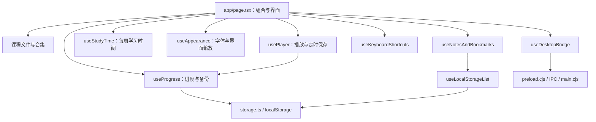

# DDCourse 架构说明

DDCourse 是本地优先的课程视频播放器。同一套 React 界面运行于 Web/PWA 和 Electron，视频文件始终由用户设备直接读取。

## 分层

`page.tsx` 负责组合状态和渲染界面。播放器、进度、快捷键、周统计、笔记列表及桌面能力分别由 Hook 管理。共享数据结构位于 `types.ts`，存储键和容错读写位于 `storage.ts`。

## 播放与进度

课程记录以“相对路径 + 文件大小”作为 ID，兼顾浏览器、桌面端和跨设备备份。播放器在暂停、切换、播放结束、页面隐藏或离开时保存；连续播放时每前进约 5 秒节流保存一次。`timeupdate` 不会无条件写入存储。

进度导入采用合并语义：导入文件中的同 ID 记录覆盖本机记录，React 状态随即更新，因此列表、统计和当前播放器不需要重新启动应用。

## 周学习时间

周标识使用本地时区的周一日期，不经过 UTC 转换。每次累计前都会重新判断周标识，应用跨周持续运行时也会自动归零。

## 笔记和收藏

Web/PWA 以 localStorage 为主存储。桌面端以“文档/DDCourse/学习笔记.json”为持久文件，同时保留 localStorage 缓存。启动时两边按照稳定 UUID 合并，兼容没有 UUID 的旧记录；桌面文件采用临时文件写入后替换，并限制单次数据为 5 MiB。

## Electron 安全边界

BrowserWindow 启用 `contextIsolation`、禁用 `nodeIntegration` 并启用 sandbox。渲染进程只能通过 preload 暴露的有限接口选择/恢复目录和读写笔记。目录扫描使用异步文件 API，跳过符号链接；单个目录或文件读取失败时记录警告并继续。

## 资源生命周期

本地视频使用 object URL 或桌面 `file:` URL。切换文件和组件卸载时会撤销 object URL。人声增强使用单个 AudioContext 和 DynamicsCompressorNode。下载备份创建的临时 URL 会延迟撤销，避免浏览器尚未读取完成。

自定义字体通过 FontFace API 激活，并以 ArrayBuffer 保存在 IndexedDB。字体系列和界面比例通过 CSS 自定义属性应用，避免组件直接维护大量字号分支。

## 后续边界

`page.tsx` 仍包含课程库、安装提示、人声增强和较大块 JSX。后续可继续拆分 `useCourseLibrary`、`useInstallPrompt`、`useVoiceEnhancer`，以及 `CourseSidebar`、`LearningMap` 和 `PlayerControls`。拆分应以状态和副作用边界为依据，而不是单纯追求行数。
